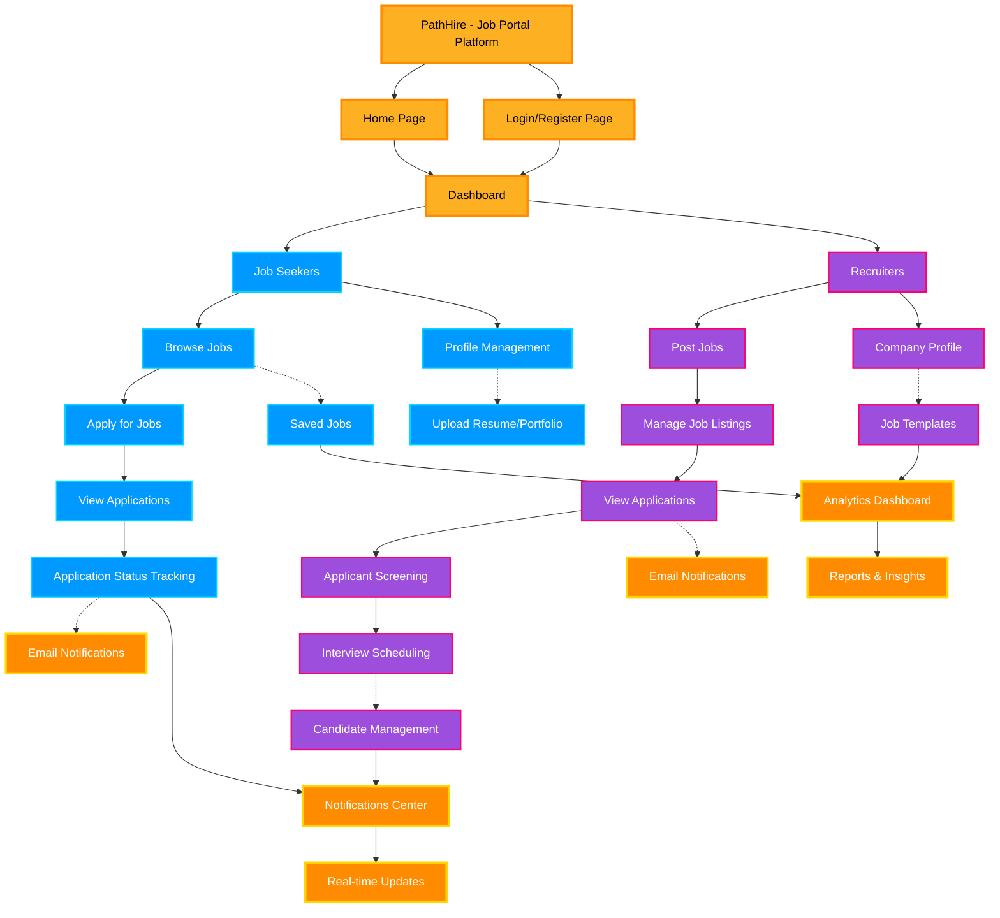

# PathHire - Job Portal Flow Diagram

## Mermaid Diagram Code



## How to Use This Diagram

### Option 1: GitHub/GitLab Markdown
Simply paste this markdown file into your GitHub or GitLab repository. Both platforms automatically render Mermaid diagrams.

### Option 2: Mermaid Live Editor
1. Go to https://mermaid.live/
2. Copy the code between the ```mermaid``` tags
3. Paste it into the editor
4. Export as PNG or SVG

### Option 3: VS Code
1. Install "Markdown Preview Mermaid Support" extension
2. Open this file in VS Code
3. Press `Ctrl+Shift+V` to preview
4. Right-click and export

### Option 4: Online Tools
- **Mermaid Chart**: https://www.mermaidchart.com/
- **Draw.io**: Import Mermaid code
- **Notion**: Supports Mermaid diagrams

## Diagram Legend

### Node Types:
- **Orange Gradient**: Main platform nodes (PathHire, Dashboard)
- **Blue Gradient**: Job Seeker features
- **Purple Gradient**: Recruiter features
- **Yellow/Orange**: Shared features and analytics

### Arrow Types:
- **Solid arrows (→)**: Primary user flow
- **Dashed arrows (-.->)**: Secondary/optional features

## Key Features Shown:

### For Job Seekers:
- Browse and search jobs
- Apply for positions
- Track application status
- Save favorite jobs
- Manage profile and resume
- Receive notifications

### For Recruiters:
- Post job openings
- Manage job listings
- Review applications
- Screen candidates
- Schedule interviews
- Track candidate pipeline
- Company profile management

### Shared Features:
- Real-time notifications
- Analytics and reporting
- Email notifications
- Dashboard insights
